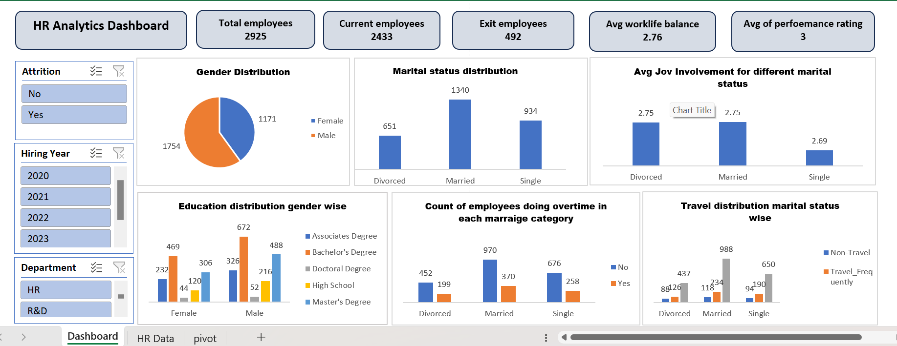

# HR Analytics Dashboard (Microsoft Excel)

An interactive **HR Analytics Dashboard** built in **Microsoft Excel**.  
It uses PivotTables, PivotCharts, and slicers to explore workforce metrics like attrition, hiring year, department, job involvement, work–life balance, and more.

> **Sheets:** `Dashboard`, `HR Data`, `pivot`  
> **Excel:** Office 365 / Excel 2019+

---

## 🔎 What’s inside the dashboard

**KPI Cards (from the screenshot):**
- **Total employees:** `2925`
- **Current employees (Attrition = No):** `2433`
- **Exit employees (Attrition = Yes):** `492`
- **Avg work–life balance:** `2.76`
- **Avg performance rating:** `3`

**Filters (Slicers):**
- **Attrition:** Yes / No  
- **Hiring Year:** 2020, 2021, 2022, 2023  
- **Department:** HR, R&D (…and any others present in data)

**Charts (per screenshot):**
- **Gender distribution** (Pie)  
- **Marital status distribution** (Column)  
- **Average Job Involvement by marital status** (Column)  
- **Education distribution by gender** (Clustered columns; Associates, Bachelor’s, Doctoral, High School, Master’s)  
- **Overtime count by marital status** (Yes/No columns)  
- **Travel distribution by marital status** (Non-Travel, Travel_Rarely, Travel_Frequently)

> Numbers update dynamically with slicers.

---

## 📁 Repository structure

hr-analytics-dashboard-excel/
├─ HR_Analytics_Dashboard.xlsx # Main workbook (Dashboard, HR Data, pivot)
├─ assets/
│ ├─ dashboard-overview.png # Screenshot of dashboard (rename yours to this)
│ └─ pivots-overview.png # Screenshot of pivot sheet (rename yours to this)
├─ data/ # (optional) place CSV/XLSX source files here
└─ README.md

If you already have screenshots named differently, just place them in `assets/` and update the image paths in this README.

---

## ▶️ How to use

1. **Clone or download** this repository.
2. Open **`HR_Analytics_Dashboard.xlsx`**.
3. Go to the **Dashboard** sheet.
4. Use the slicers (Attrition, Hiring Year, Department) to filter.
5. All KPI cards and charts will update automatically.
6. To refresh after data changes: **Data → Refresh All**.

---

## 🔧 Rebuild steps (if you want to recreate from scratch)

1. **Prepare the data**
   - Put your dataset on the **`HR Data`** sheet.
   - Convert it to an Excel Table (**Ctrl + T**) and name it `HR_Data`.

   **Common columns (as used in this dashboard):**
   - `emp no` (unique ID)  
   - `Gender`  
   - `MaritalStatus` (Single, Married, Divorced)  
   - `Attrition` (Yes/No)  
   - `Department` (HR, R&D, …)  
   - `Education` (High School, Associates Degree, Bachelor's Degree, Master's Degree, Doctoral Degree)  
   - `OverTime` (Yes/No)  
   - `BusinessTravel` (Non-Travel, Travel_Rarely, Travel_Frequently)  
   - `JobInvolvement` (numeric scale)  
   - `WorkLifeBalance` (numeric scale)  
   - `PerformanceRating` (numeric scale)  
   - `Hiring Year` (e.g., 2020–2023)

2. **Create PivotTables on the `pivot` sheet**
   - **Gender distribution:**  
     - Rows: `Gender`  
     - Values: `Count of emp no`
   - **Marital status distribution:**  
     - Rows: `MaritalStatus`  
     - Values: `Count of emp no`
   - **Avg Job Involvement by marital status:**  
     - Rows: `MaritalStatus`  
     - Values: `Average of JobInvolvement`
   - **Education distribution by gender:**  
     - Rows: `Gender`  
     - Columns: `Education`  
     - Values: `Count of emp no`
   - **Overtime by marital status:**  
     - Rows: `MaritalStatus`  
     - Columns: `OverTime` (Yes/No)  
     - Values: `Count of emp no`
   - **Travel distribution by marital status:**  
     - Rows: `MaritalStatus`  
     - Columns: `BusinessTravel`  
     - Values: `Count of emp no`
   - **KPI tables:**  
     - **Total Employees:** Values: `Count of emp no`  
     - **Current Employees:** Filter `Attrition = No`, Values: `Count of emp no`  
     - **Exit Employees:** Filter `Attrition = Yes`, Values: `Count of emp no`  
     - **Average WorkLifeBalance:** Values: `Average of WorkLifeBalance`  
     - **Average PerformanceRating:** Values: `Average of PerformanceRating`

3. **Insert PivotCharts**
   - Gender: Pie
   - Others: Clustered Column (per the screenshot)

4. **Add slicers & connect them**
   - Insert slicers for: `Attrition`, `Hiring Year`, `Department`.
   - Right-click each slicer → **Report Connections** → check all PivotTables/Charts.

5. **Build KPI cards**
   - Insert Shapes for each KPI and link text boxes to the cells holding the KPI values  
     (can use `=GETPIVOTDATA(...)` or direct pivot cells).

6. **Formatting**
   - Clean titles, labels, and number formatting.
   - Arrange charts in a grid layout to match the screenshot.

---

## 🧠 Interpreting the default (unfiltered) view

- **Gender:** Male `1754`, Female `1171`.  
- **Marital status:** Married `1340`, Single `934`, Divorced `651`.  
- **Avg Job Involvement:** ~`2.75` (Married & Divorced), `2.69` (Single).  
- **Overtime (counts):** Higher counts in Married and Single vs Divorced.  
- **Travel:** Most employees are **Travel_Rarely**, then **Travel_Frequently**, then **Non-Travel**.  
- **Education by gender:** All five levels are represented across Male/Female.

> These figures update when you change slicers.

---

## 📦 Requirements

- Microsoft **Excel 2019 or Office 365** (recommended)
- No external add-ins required

---

## 🔁 Updating the data

1. Replace/append rows in the **`HR Data`** sheet (keep headers consistent).
2. **Data → Refresh All** to update all pivots, charts, and KPIs.
3. Adjust slicer items if new categories appear.

---

## 🤝 Contributing

1. Fork the repo
2. Create a feature branch: `git checkout -b feature/my-update`
3. Commit: `git commit -m "Add: new chart / fix formatting"`
4. Push: `git push origin feature/my-update`
5. Open a Pull Request

---

## 🖼️ Screenshots

Place your images here and use these names:
- `assets/dashboard-overview.png`
- `assets/pivots-overview.png`

---

## 📄 License

MIT License. See `LICENSE` for details.

---

## 👤 Author

**Md Shahid Afridi**  
Data Analyst & BI Enthusiast
